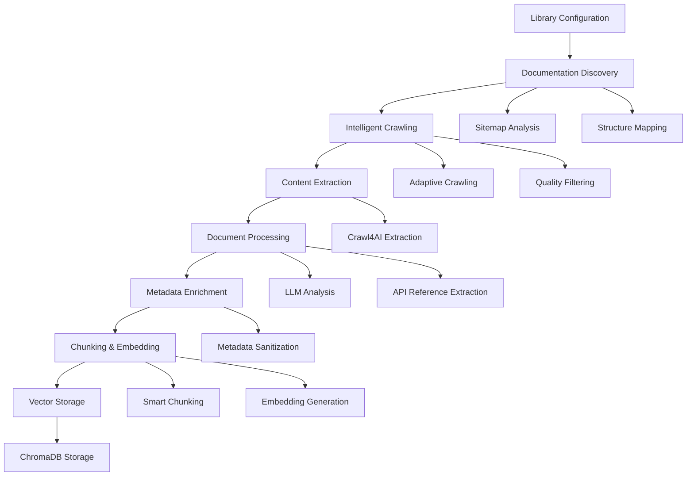

# PyRAG Data Ingestion Pipeline - Complete Overview

## 🎯 **Executive Summary**

PyRAG employs a sophisticated **two-phase ingestion pipeline** designed to create comprehensive, AI-optimized documentation embeddings for coding assistants. The system intelligently discovers, extracts, processes, and indexes Python library documentation with advanced metadata enrichment and quality assurance.

---

## 🏗️ **Architecture Overview**

---

## 📋 **Phase 1: Discovery & Planning**

### **1.1 Library Configuration**
- **Source**: `config/libraries.json`
- **Function**: Defines target libraries with priority, complexity, and coverage requirements
- **Key Features**:
  - Priority-based processing (1=highest)
  - Expected complexity assessment (high/medium/low)
  - Category classification (ai_ml, data_validation, web, etc.)
  - Coverage targets for comprehensive documentation

### **1.2 Sitemap Analysis**
- **Component**: `SitemapAnalyzer` 
- **Purpose**: Comprehensive URL discovery and categorization
- **Capabilities**:
  - Multi-format sitemap parsing (XML, robots.txt, HTML)
  - Intelligent URL categorization (docs, API, tutorials, examples)
  - Coverage estimation and structure insights
  - Priority scoring based on content type

### **1.3 Documentation Structure Mapping**
- **Component**: `DocumentationStructureMapper`
- **Purpose**: Build hierarchical understanding of documentation
- **Features**:
  - Parent-child relationship detection
  - Content importance scoring
  - Dependency mapping between pages
  - Navigation structure analysis

---

## 📋 **Phase 2: Content Acquisition**

### **2.1 Intelligent Crawling**
- **Component**: `Crawler` with adaptive strategies
- **Strategies Available**:
  - **Aggressive**: High concurrency, broad coverage
  - **Balanced**: Moderate speed with quality focus
  - **Selective**: High-quality content prioritization
  - **Comprehensive**: Maximum coverage with depth

### **2.2 Crawling Features**
- **Adaptive Depth**: Adjusts crawl depth based on content quality
- **Rate Limiting**: Respectful crawling with configurable delays
- **Quality Filtering**: Content quality thresholds to avoid low-value pages
- **Relationship Tracking**: Maintains page interdependencies
- **Progress Monitoring**: Real-time statistics and error handling

### **2.3 Content Extraction**
- **Component**: `Crawl4AIClient` (replaces Firecrawl for local processing)
- **Advantages**:
  - **No API limits** - unlimited local processing
  - **Cost-effective** - no external service fees
  - **Fast processing** - local extraction
  - **Privacy-first** - no data sent to third parties

---

## 📋 **Phase 3: Processing & Enhancement**

### **3.1 Document Processing Pipeline**
- **Component**: `DocumentProcessor` with single-LLM optimization
- **Process Flow**:
  1. Content extraction (markdown preferred)
  2. Basic API reference extraction via regex
  3. **Single LLM call** for comprehensive document analysis
  4. Smart chunking based on document structure
  5. Metadata enrichment and sanitization

### **3.2 Document Structure Analysis**
- **Component**: `DocumentStructureAnalyzer`
- **AI-Powered Analysis**:
  - Content type identification (tutorial, reference, guide, etc.)
  - Main topic extraction
  - Key concepts and terminology
  - Code example detection
  - Difficulty level assessment
  - Prerequisites identification

### **3.3 Metadata Enrichment**
- **Components**: `MetadataSanitizer`, Enhanced processing
- **Enrichment Features**:
  - **Content Classification**: Automatic categorization
  - **Topic Extraction**: Main topics and subtopics
  - **API References**: Function, class, and method extraction
  - **Difficulty Assessment**: Beginner/intermediate/advanced
  - **Prerequisites**: Required knowledge identification
  - **Key Concepts**: Important terminology extraction
  - **Code Examples**: Detection and categorization

### **3.4 Smart Chunking Strategy**
- **Approach**: Structure-aware chunking based on LLM analysis
- **Chunk Types**:
  - **Concept chunks**: Core explanations and theory
  - **Example chunks**: Code examples with context
  - **Reference chunks**: API documentation sections
  - **Tutorial chunks**: Step-by-step instructions
- **Overlap Strategy**: Intelligent overlap to maintain context

---

## 📋 **Phase 4: Storage & Indexing**

### **4.1 Vector Storage**
- **Component**: `VectorStore` with ChromaDB backend
- **Features**:
  - High-dimensional embeddings (sentence-transformers)
  - Metadata filtering capabilities
  - Efficient similarity search
  - Persistent storage

### **4.2 Embedding Generation**
- **Component**: `EmbeddingService`
- **Model**: Sentence-transformers for semantic understanding
- **Optimization**: Batch processing for efficiency

---

## 🔧 **Key Components Deep Dive**

### **DocumentationManager**
**Role**: Orchestrates the entire ingestion pipeline
- **Two-phase processing**: Discovery → Content acquisition
- **Parallel processing**: Concurrent URL processing for speed
- **Error handling**: Comprehensive error recovery and reporting
- **Progress tracking**: Real-time statistics and completion estimates

### **Crawl4AI Integration** 
**Benefits over Firecrawl**:
- ✅ **No API costs** - completely free
- ✅ **No rate limits** - process unlimited pages
- ✅ **Local processing** - privacy and speed
- ✅ **Same interface** - drop-in replacement

### **Quality Assurance Pipeline**
- **Content validation**: Ensures meaningful content extraction
- **Metadata validation**: Schema compliance and data quality
- **Duplicate detection**: Prevents redundant processing
- **Error recovery**: Robust handling of failed requests

---

## 📊 **Performance Characteristics**

### **Scalability**
- **Concurrent Processing**: Configurable worker pools
- **Memory Efficient**: Streaming processing for large datasets
- **Adaptive Rate Limiting**: Prevents server overload

### **Quality Metrics**
- **Coverage Estimation**: Predictive analysis of documentation completeness
- **Content Quality Scoring**: Automated quality assessment
- **Processing Statistics**: Detailed metrics for optimization

### **Error Resilience**
- **Retry Mechanisms**: Automatic retry for transient failures
- **Graceful Degradation**: Continues processing despite partial failures
- **Comprehensive Logging**: Detailed error tracking and debugging

---

## 🎯 **Configuration & Customization**

### **Library-Specific Configuration**
Each library in `config/libraries.json` supports:
- **Priority levels**: Processing order optimization
- **Complexity expectations**: Resource allocation
- **Coverage targets**: Specific URL patterns to ensure coverage
- **Custom parameters**: Library-specific processing options

### **Crawling Strategy Customization**
- **max_concurrent_requests**: Concurrency control
- **request_delay**: Rate limiting configuration
- **content_quality_threshold**: Quality filtering
- **adaptive_depth**: Dynamic depth adjustment
- **max_pages_per_type**: Content type limits

---

## 🚀 **Optimization Features**

### **Intelligent Processing**
- **Single LLM Call**: Optimized metadata extraction to reduce API costs
- **Batch Processing**: Efficient handling of document collections  
- **Caching**: Prevents reprocessing of unchanged content
- **Progressive Enhancement**: Iterative quality improvements

### **AI-Optimized Output**
- **Multi-dimensional Metadata**: Rich context for search algorithms
- **Semantic Chunking**: Preserves meaning across chunk boundaries
- **Relationship Preservation**: Maintains document interconnections
- **Quality Scoring**: Enables intelligent result ranking

---

## 📈 **Pipeline Flow Summary**

1. **Initialize** → Load library configurations and initialize components
2. **Discover** → Analyze sitemaps and map documentation structure
3. **Plan** → Generate crawling strategy based on structure analysis
4. **Crawl** → Intelligently extract content using adaptive strategies
5. **Process** → Apply LLM analysis for metadata enrichment
6. **Chunk** → Create semantically meaningful content chunks
7. **Embed** → Generate vector embeddings for similarity search
8. **Store** → Persist to ChromaDB with comprehensive metadata

---

## 🎯 **Result**

The PyRAG ingestion pipeline produces **AI-optimized documentation embeddings** with:

- ✅ **Comprehensive coverage** through intelligent discovery
- ✅ **High-quality metadata** via LLM analysis
- ✅ **Semantic preservation** through smart chunking
- ✅ **Cost efficiency** with single-LLM optimization
- ✅ **Scalable processing** with parallel architectures
- ✅ **Quality assurance** through validation pipelines

This enables PyRAG to provide highly relevant, contextually rich search results for AI coding assistants working with Python library documentation.

---

*This pipeline transforms raw documentation websites into a sophisticated, searchable knowledge base optimized for AI-powered development workflows.*