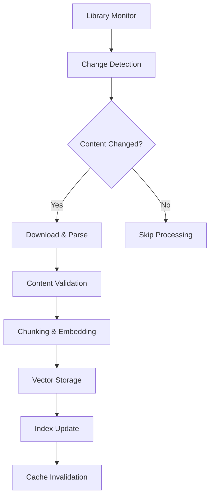

# PyRAG: Python Documentation RAG System
## Comprehensive Implementation Guide

### Executive Summary

PyRAG is an open-source RAG (Retrieval-Augmented Generation) system specifically designed to keep AI coding assistants current with the latest Python library documentation. By providing real-time access to up-to-date API references, examples, and best practices through the Model Context Protocol (MCP), PyRAG solves the critical problem of AI assistants suggesting outdated or deprecated code patterns.

---

## Project Goals

### Primary Objective
Create a specialized RAG layer that bridges the gap between rapidly evolving Python library documentation and AI coding assistants, ensuring developers receive current and accurate code suggestions.

### Key Goals
- **Currency**: Maintain up-to-date documentation for top Python libraries within 2 hours of releases
- **Accuracy**: Provide contextually relevant, semantically accurate documentation retrieval
- **Accessibility**: Integrate seamlessly with popular coding assistants via MCP
- **Scalability**: Support 100+ Python libraries with sub-200ms query response times
- **Community Impact**: Improve Python development experience across the ecosystem

### Success Metrics
- **Technical**: Query accuracy >95%, update latency <2 hours, API response time <200ms p95
- **Adoption**: 1000+ active MCP server installations within 6 months
- **Impact**: Measurable reduction in deprecated API suggestions from integrated coding assistants

---

## Technical Architecture

### System Components

#### 1. Documentation Ingestion Pipeline
**Purpose**: Automated collection and processing of Python library documentation

**Components**:
- **Multi-Source Scrapers**
  - Sphinx documentation processors (NumPy, SciPy, Django)
  - MkDocs parsers (FastAPI, Pydantic)
  - GitHub repository monitors (READMEs, wikis, release notes)
  - PyPI metadata extractors
  - Official tutorial crawlers

- **Change Detection System**
  - RSS/Atom feed monitoring
  - GitHub webhook integrations
  - PyPI release API monitoring
  - Content hash-based change detection
  - Scheduled deep crawls for sites without notifications

#### 2. Document Processing Engine
**Purpose**: Transform raw documentation into semantically meaningful, retrievable chunks

**Hierarchical Chunking Strategy**:
```
Library Level: requests
├── Module Level: requests.auth
│   ├── Class Level: HTTPBasicAuth
│   │   ├── Method Level: __call__()
│   │   │   ├── Signature chunk
│   │   │   ├── Description chunk  
│   │   │   └── Example chunk
│   │   └── Full class context chunk
│   └── Module overview chunk
└── Library overview chunk
```

**Content Enrichment**:
- Parameter type extraction from docstrings
- Deprecation status tracking with replacement suggestions
- Version compatibility mapping
- Cross-reference relationship preservation
- Code example validation and testing

#### 3. Vector Database Layer
**Purpose**: Efficient storage and retrieval of embedded documentation

**Multi-Index Architecture**:
- **Semantic Index**: Dense embeddings for conceptual searches
- **Code Index**: Specialized embeddings for function signatures and patterns
- **Example Index**: Optimized for usage pattern matching
- **Keyword Index**: Traditional search for exact API names

**Metadata Schema**:
```json
{
  "content": "Documentation text content",
  "library": "requests",
  "version": "2.31.0",
  "hierarchy": ["requests", "auth", "HTTPBasicAuth", "__call__"],
  "content_type": "method_description|example|signature|overview",
  "dependencies": ["urllib3", "certifi"],
  "related_concepts": ["authentication", "sessions"],
  "deprecated": false,
  "added_in": "2.28.0",
  "source_url": "https://docs.python-requests.org/...",
  "confidence_score": 0.95,
  "last_updated": "2024-12-01T10:30:00Z"
}
```

#### 4. Retrieval System
**Purpose**: Intelligent, context-aware document retrieval

**Multi-Stage Process**:
1. **Query Analysis**: Intent detection, library identification, specificity assessment
2. **Multi-Index Search**: Parallel queries across all indexes with result fusion
3. **Context Assembly**: Hierarchical context gathering and relationship mapping
4. **Reranking**: Score adjustment based on recency, popularity, deprecation status
5. **Response Construction**: Structured output with examples and related information

#### 5. MCP Server Interface
**Purpose**: Standardized integration with AI coding assistants

**Exposed Tools**:
```json
{
  "tools": [
    {
      "name": "search_python_docs",
      "description": "Search current Python library documentation with semantic understanding",
      "parameters": {
        "query": {
          "type": "string",
          "description": "Natural language query about Python functionality"
        },
        "library": {
          "type": "string", 
          "optional": true,
          "description": "Specific library to search within"
        },
        "version": {
          "type": "string",
          "optional": true, 
          "description": "Specific version constraint"
        },
        "content_type": {
          "type": "string",
          "optional": true,
          "enum": ["examples", "reference", "tutorials", "all"],
          "description": "Type of documentation to prioritize"
        }
      }
    },
    {
      "name": "get_api_reference",
      "description": "Get detailed API reference for specific functions/classes",
      "parameters": {
        "library": {"type": "string"},
        "api_path": {"type": "string", "description": "e.g., 'pandas.DataFrame.merge'"},
        "include_examples": {"type": "boolean", "default": true}
      }
    },
    {
      "name": "check_deprecation",
      "description": "Check if APIs are deprecated and get replacement suggestions",
      "parameters": {
        "library": {"type": "string"},
        "apis": {"type": "array", "items": {"type": "string"}}
      }
    },
    {
      "name": "find_similar_patterns",
      "description": "Find similar usage patterns or alternative approaches",
      "parameters": {
        "code_snippet": {"type": "string"},
        "intent": {"type": "string", "optional": true}
      }
    }
  ]
}
```

---

## Technology Stack

### Core Infrastructure
- **Language**: Python 3.11+ (for async support and performance)
- **Web Framework**: FastAPI (for MCP server and management API)
- **Database**: PostgreSQL with pgvector extension (Docker local, managed cloud production)
- **Vector Database**: ChromaDB (development), Weaviate (production)
- **Message Queue**: Redis for async processing (add in Phase 2)
- **Task Queue**: Celery for background jobs (add in Phase 2)

### AI/ML Stack
- **Embeddings**: OpenAI text-embedding-3-large (production) or Sentence-Transformers all-MiniLM-L6-v2 (local)
- **Text Processing**: spaCy for NLP preprocessing
- **Code Analysis**: AST parsing for Python code validation
- **Similarity Search**: ChromaDB built-in (development), Weaviate (production)

### Documentation Processing
- **Web Scraping**: Playwright for dynamic content, BeautifulSoup for static parsing
- **Document Parsing**: 
  - Sphinx: Custom reStructuredText parser
  - MkDocs: Markdown processor with frontmatter extraction
  - GitHub: PyGithub API for repository content
- **Content Validation**: pytest for example code testing

### Local Development Infrastructure
- **Containerization**: Docker with Docker Compose
- **Vector Storage**: ChromaDB (SQLite backend, in-memory for testing)
- **Database**: PostgreSQL with pgvector (Docker container)
- **Development Tools**: pre-commit hooks, pytest, black formatter
- **Monitoring**: Basic logging with structured JSON format

## Local Development Setup & Architecture

### Development Environment Requirements
- **Python**: 3.11+ with virtual environment support
- **Docker**: Docker Desktop or Docker Engine with Docker Compose
- **Memory**: Minimum 8GB RAM (16GB recommended for embedding generation)
- **Storage**: 10GB+ free space for document storage and vector indexes
- **Network**: Stable internet connection for documentation scraping and API calls

### Local Storage Architecture

#### **Vector Database: ChromaDB (Development)**
ChromaDB will be configured for local development with persistent storage to maintain data across sessions. The system will use in-memory storage for testing to enable fast iteration cycles. Collections will be organized by content type with appropriate embedding functions for semantic search.

#### **PostgreSQL Database Schema**
The relational database will track library metadata, version information, legal compliance status, and system analytics. Key tables include:

**Core Library Tracking**:
- Libraries table with licensing and repository information
- Library versions with release tracking and indexing status
- Document chunks with hierarchical organization and content hashing

**Legal Compliance Management**:
- Compliance status tracking with license approval and maintainer communication
- Terms of service compliance and opt-out request handling
- Update logs for monitoring changes and processing status

**System Analytics**:
- Query performance metrics and user satisfaction tracking
- Response time monitoring and result quality assessment
- Usage patterns for system optimization

### Development Workflow Setup

#### **Project Structure**
The project will be organized into clear modules:
- Core database and vector store management
- Specialized scrapers for different documentation formats
- Document processing and validation systems
- Retrieval and reranking components
- MCP server implementation and tool definitions
- FastAPI application with REST endpoints

#### **Development Services**
Docker Compose will orchestrate local services including PostgreSQL with pgvector extension, optional Redis for task queuing, and Jupyter notebooks for experimentation. Services will include health checks and proper dependency management.

#### **Testing Infrastructure**
Comprehensive testing setup with pytest fixtures for isolated testing, in-memory databases for fast iteration, and sample data fixtures for consistent development experience.

## Implementation Phases

### Phase 1: Foundation & Local Development (Weeks 1-4)
**Objective**: Core RAG system with local storage and basic functionality

**Infrastructure Setup**:
- Local PostgreSQL + pgvector with Docker Compose
- ChromaDB with persistent local storage
- Basic FastAPI application structure
- Development environment automation scripts

**Core Components**:
- Document ingestion pipeline for 5 initial libraries (requests, httpx, fastapi, pydantic, sqlalchemy)
- Hierarchical chunking system with PostgreSQL metadata tracking
- ChromaDB vector storage with local Sentence-Transformers embeddings
- Basic semantic search and retrieval system
- Simple REST API for testing queries

**Deliverables**:
- Working local development environment
- Database schema and migrations
- Basic document processing pipeline
- Simple query interface for validation
- Comprehensive test suite with 80%+ coverage

**Success Criteria**:
- Query response time <500ms for local ChromaDB
- Successful indexing of 5 libraries (~1000 documentation chunks)
- Basic semantic search returning relevant results
- Clean separation of concerns in codebase architecture

### Phase 2: MCP Integration & Production Readiness (Weeks 5-8)
**Objective**: MCP server implementation with enhanced retrieval capabilities

**MCP Development**:
- MCP server wrapper around core RAG system  
- Tool definitions for documentation search
- Cursor integration documentation and testing
- Error handling and response formatting

**Enhanced Features**:
- Multi-index retrieval (API reference, examples, tutorials)
- Query analysis and rewriting capabilities
- Result reranking based on relevance and recency
- Caching layer for improved performance

**Production Preparation**:
- Migration scripts for Weaviate deployment
- Monitoring and logging infrastructure
- Rate limiting and authentication
- Documentation website and API docs

**Deliverables**:
- Working MCP server compatible with Cursor
- Enhanced retrieval with multiple content types
- Production deployment scripts
- User documentation and integration guides

### Phase 3: Scale & Advanced Features (Weeks 9-12)
**Objective**: Advanced RAG capabilities and ecosystem expansion

**Advanced Retrieval**:
- GraphRAG foundation with relationship mapping
- Multi-hop reasoning for complex queries
- Agentic query planning and execution
- Advanced reranking with learning capabilities

**Ecosystem Growth**:
- Support for 25+ Python libraries
- Automated update pipeline with change detection
- Community contribution system
- Legal compliance dashboard

**Performance Optimization**:
- Query optimization and caching strategies
- Horizontal scaling capabilities
- Advanced monitoring and alerting
- Cost optimization analysis

**Deliverables**:
- GraphRAG-enhanced system for complex queries
- Automated library addition and maintenance
- Community engagement tools
- Performance benchmarks and optimization

### Phase 4: Community & Long-term Sustainability (Weeks 13-16)
**Objective**: Community adoption and sustainable development model

**Community Building**:
- Integration guides for multiple coding assistants
- Developer API and SDK
- Community contribution guidelines
- Partnership development with library maintainers

**Advanced Intelligence**:
- Adaptive retrieval based on query patterns
- Personalized responses based on user context
- Integration with code analysis tools
- Advanced deprecation detection and migration guidance

**Business Sustainability**:
- Usage analytics and insights dashboard
- Enterprise features (authentication, rate limiting, private libraries)
- Cost modeling and optimization
- Long-term technical roadmap

**Deliverables**:
- Multi-platform integrations beyond Cursor
- Community-driven library coverage expansion
- Enterprise-ready features and documentation
- Sustainable development and maintenance model

---

## Data Pipeline Architecture

### Ingestion Workflow


### Real-Time Processing
- **Event-Driven Architecture**: Redis pub/sub for coordination
- **Incremental Updates**: Only process changed content
- **Batch Processing**: Bulk operations during low-traffic periods
- **Rollback Capability**: Version control for content changes

### Quality Assurance
- **Code Example Validation**: Automated testing of example code
- **Link Verification**: Automated checking of cross-references
- **Content Freshness Tracking**: Metrics on documentation currency
- **Community Feedback Integration**: User reporting of incorrect information

---

## User Experience Design

### Cursor Integration
**Setup Process**:
1. User adds MCP server configuration to Cursor's `mcp.json`
2. Cursor automatically detects and loads available tools
3. User can immediately query Python documentation through natural language
4. Results include code examples, deprecation warnings, and version info

**Example Interaction**:
```
User: "How do I make an authenticated HTTP request with requests library?"

PyRAG Response:
- Current best practice: requests.Session with auth parameter
- Code example with error handling
- Alternative approaches (OAuth, custom headers)
- Related concepts (session reuse, connection pooling)
- Version compatibility notes
```

### Query Optimization
- **Context-Aware Responses**: Consider user's current codebase when possible
- **Progressive Disclosure**: Start with essentials, provide "show more" for details
- **Error Prevention**: Proactively suggest alternatives for deprecated APIs
- **Learning Integration**: Track common queries to improve documentation coverage

---

## Performance Requirements

### Response Time Targets
- **Query Processing**: <200ms p95 for search requests
- **Update Latency**: <2 hours from library release to indexed
- **Cache Hit Ratio**: >80% for common queries
- **Concurrent Users**: Support 1000+ simultaneous queries

### Scalability Design
- **Horizontal Scaling**: Stateless API servers behind load balancer
- **Database Optimization**: Read replicas for query distribution
- **Caching Strategy**: Multi-layer caching (Redis, CDN, application-level)
- **Resource Management**: Auto-scaling based on query volume

### Reliability Requirements
- **Uptime**: 99.9% availability target
- **Fault Tolerance**: Graceful degradation when services unavailable
- **Data Consistency**: Eventually consistent updates with conflict resolution
- **Backup & Recovery**: Daily backups with point-in-time recovery

---

## Security & Privacy

### Data Protection
- **Content Licensing**: Respect library documentation licenses
- **Attribution**: Proper citation of original sources
- **User Privacy**: No storage of user queries or code context
- **API Security**: Rate limiting, authentication for admin functions

### Operational Security
- **Input Validation**: Sanitization of all user inputs
- **Dependency Management**: Regular security updates
- **Access Control**: Role-based access for administrative functions
- **Audit Logging**: Comprehensive logging for security monitoring

---

## Community & Governance

### Open Source Strategy
- **License**: MIT License for maximum adoption
- **Contribution Guidelines**: Clear process for community contributions
- **Issue Management**: Transparent issue tracking and roadmap
- **Documentation**: Comprehensive docs for users and contributors

### Community Building
- **Developer Advocacy**: Engagement with Python community
- **Integration Support**: Help other tools integrate with PyRAG
- **Feedback Loops**: Regular community surveys and feature requests
- **Educational Content**: Blog posts, tutorials, conference talks

---

## Monitoring & Analytics

### System Metrics
- **Performance**: Response times, throughput, error rates
- **Usage**: Query patterns, popular libraries, user engagement
- **Quality**: Accuracy metrics, user feedback scores
- **Infrastructure**: Resource utilization, cost optimization

### Business Metrics
- **Adoption**: MCP server installations, active users
- **Value**: Reduction in deprecated API suggestions
- **Growth**: Library coverage expansion, community contributions
- **Sustainability**: Cost per query, resource efficiency

---

## Risk Assessment & Mitigation

### Technical Risks
- **Documentation Format Changes**: Maintain flexible parsers with fallback strategies
- **API Rate Limits**: Implement respectful scraping with backoff mechanisms
- **Vector Database Costs**: Optimize embeddings and implement intelligent caching
- **Performance Degradation**: Continuous monitoring with automated scaling

### Business Risks
- **Competition**: Focus on Python specialization and community building
- **Sustainability**: Plan for operational costs and potential funding sources
- **Legal Issues**: Ensure compliance with documentation licensing terms
- **Community Fragmentation**: Build bridges rather than competing solutions

---

## Success Criteria & Milestones

### 3-Month Goals
- [ ] Core system operational with 20 popular libraries
- [ ] Cursor MCP integration working smoothly
- [ ] <500ms query response times achieved
- [ ] 100+ GitHub stars and community engagement

### 6-Month Goals
- [ ] 50+ libraries supported with automated updates
- [ ] 1000+ active MCP installations
- [ ] Additional coding assistant integrations
- [ ] Community contributions and ecosystem growth

### 1-Year Vision
- [ ] Comprehensive Python ecosystem coverage
- [ ] Industry standard for Python documentation RAG
- [ ] Sustainable community governance model
- [ ] Measurable impact on Python development productivity

---

## Getting Started

### For Contributors
1. Clone the repository and set up development environment
2. Run local instance with Docker Compose
3. Follow contribution guidelines for code standards
4. Join community discussions and planning sessions

### For Users
1. Install PyRAG MCP server following setup guide
2. Configure integration with preferred coding assistant
3. Begin using enhanced Python documentation queries
4. Provide feedback and report issues

---

## Conclusion

PyRAG represents a strategic opportunity to significantly improve Python development workflows by solving the fundamental problem of outdated AI coding assistance. By building on the emerging MCP standard and focusing on the specific needs of Python developers, this project can become essential infrastructure for the Python ecosystem.

The combination of technical feasibility, clear market need, and strong open-source community potential makes PyRAG a compelling project that can deliver real value while advancing the state of AI-assisted development.